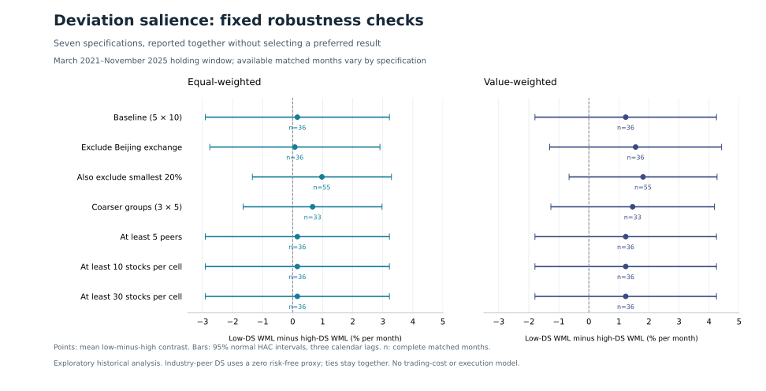

# Deviation Salience & Short-Term Return Predictability

[](https://github.com/skylarhezhentian/DeviationSalience-ShortTermMomentum-Reversal/actions/workflows/tests.yml)

**Does a stock's deviation from its industry peers help distinguish next-month momentum from reversal?**

An empirical asset-pricing study using Chinese equity data from January 2021 to November 2025. The project builds an industry-relative deviation-salience signal, forms monthly portfolios, and evaluates the hypothesis with matched-month comparisons, controlled cross-sectional regressions, and fixed robustness checks.

**Finding:** seven specifications, including the corrected baseline, do not establish a reliable positive low-salience versus high-salience WML contrast. All fourteen headline 95% confidence intervals include zero. The controlled regression interaction is also inconclusive. Coverage and missing corporate-action outcomes materially limit interpretation.

[Read the results](docs/results.md) · [Evaluation protocol](docs/research_protocol.md) · [Data sources and audit](docs/data_sources.md) · [Reproduce](docs/reproduce.md)

## Main result

WML is the next-month return of formation-period winners minus losers. The central hypothesis predicts a positive **low-DS WML minus high-DS WML** contrast.

| Baseline weighting | Mean contrast / month | HAC t-statistic | 95% confidence interval | Matched months |
|---|---:|---:|---:|---:|
| Equal-weighted | +0.156% | 0.10 | [−2.909%, +3.221%] | 36 / 57 |
| Formation-cap weighted | +1.227% | 0.80 | [−1.794%, +4.248%] | 36 / 57 |

The holding window is March 2021–November 2025. Intervals use three-calendar-lag Bartlett HAC with a normal critical value. The sample has already been examined, so these are exploratory historical estimates. Available-month means can be selected by missingness.



## Research implementation

- **Calendar-correct panel:** 6.07 million daily price observations become adjacent-calendar-month adjusted returns. Industry peers are leave-one-out averages with one observation per stock.
- **Formation before outcomes:** signal groups, eligibility, and weights are fixed before joining next-month returns. Equal signals stay together; no arbitrary stock-order tie breaking.
- **Explicit missing outcomes:** all 178 unavailable holdings are audited. Complete portfolios are primary; selected-sample and assumed-return scenarios are reported separately.
- **Statistical evaluation:** 5 × 10 portfolio sorts, an unconditional return-sort benchmark, seven fixed specifications, three historical subperiods, and Fama–MacBeth regressions with size, momentum, and volatility controls.
- **Targeted enrichment:** a documented FRED/OECD rate proxy supports a matched-window signal sensitivity. Official event records help distinguish real price jumps, suspensions, and merger-related disappearances.
- **Reproducibility:** deterministic synthetic inputs, unit tests, independent saved-output checks, file hashes, and an automated public demo.

## Run the public demo

Python 3.11 is the tested environment. In a fresh virtual environment:

```bash
python -m pip install -r requirements-tested.txt
python scripts/make_demo_data.py --run
```

The command generates fictitious data, runs the same baseline pipeline, produces figures, and validates the outputs. No account, private dataset, or API key is needed. Every demonstration report and figure is labeled **synthetic**; its numbers are software fixtures, not market evidence.

For the tests alone:

```bash
python -m unittest discover -s tests -v
```

[Full reproduction instructions](docs/reproduce.md) cover authorized local data, the optional rate download, hypothesis evaluation, and report generation. The original market data and stock-level derived records are excluded from the repository.

## Signal and portfolio construction

For stock return `r` and the equal-weighted return `peer` of its other eligible industry members:

```text
DS = |r − peer| / (|r| + |peer|)
```

The baseline explicitly sets the risk-free rate to zero. It requires at least three industry peers, sorts stocks into five DS groups and then ten return groups, and fixes equal or capitalization weights at formation. The immediately following calendar month supplies the untrimmed holding return. A final cell needs at least 20 stocks and every constituent's return to be available.

Quantile labels use the right endpoint of the empirical distribution, preserving ties even when groups become unequal or empty. Around 29% of formation observations have DS exactly one. Missing calendar positions are retained in uncertainty calculations.

The rate-proxy sensitivity replaces the denominator with `|r − rf| + |peer − rf|` while retaining raw holding returns. It is a limited retrospective approximation, not a realized Treasury-return series.

## Navigate the project

| Location | Purpose |
|---|---|
| [`src/ds_baseline.py`](src/ds_baseline.py) | Monthly panel, signal, portfolios, matched spreads, HAC inference |
| [`src/research.py`](src/research.py) | Restricted universes, benchmarks, regressions, missing-return and RF sensitivities |
| [`scripts/`](scripts/) | Reproduction, audit, synthetic demo, independent validation, reports |
| [`configs/robustness.json`](configs/robustness.json) | Fixed evaluation choices |
| [`tests/`](tests/) | Timing, future-data independence, ties, arithmetic, inference, and data-quality tests |
| [`docs/results.md`](docs/results.md) | Empirical findings, uncertainty, and aggregate tables |

## Interpretation and provenance

This implementation adapts the question in Chen, Wang and Yu's [*Salience and Short-term Momentum and Reversals*](https://ssrn.com/abstract=4649393) to industry peers in the supplied equity universe. It does not claim to replicate the paper's U.S. results.

The study corrects return timing, repeated-row peer calculations, calendar-gap handling, and future-availability effects in the earlier exploration. The original [research design](research_design.md), [variable definitions](variable_definitions.md), [data dictionary](data_dictionary.md), and [institutional background](ashare_institutional_background.md) remain labeled as proposals; the implemented protocol and results above describe the completed work.

Point-in-time data vintages, complete delisting consideration, liquidity, short availability, transaction costs, and executable month-end prices remain unresolved. These results are statistical return comparisons; no risk-adjusted alpha, out-of-sample performance, or implementable trading profit is claimed.
